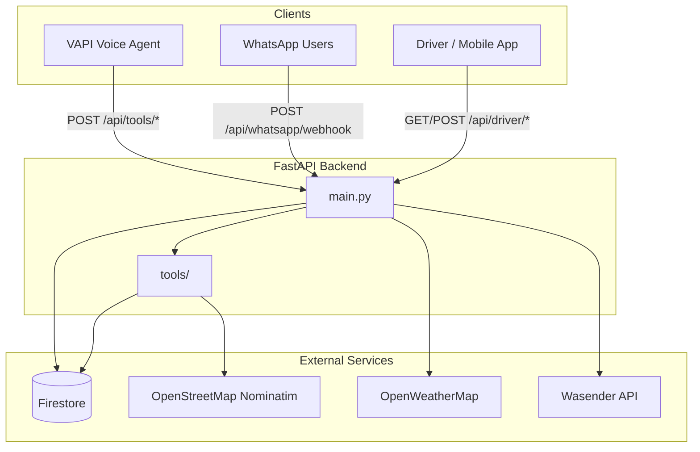

# Road Complaint Backend

A **FastAPI** backend for a civic road-complaint platform aimed at Indian roads (especially Madhya Pradesh). Citizens can report potholes, waterlogging, drainage issues, and more via **voice (VAPI)** or **WhatsApp**. The same data powers a **driver safety** layer that warns nearby motorists about hazards with Hindi voice-style alerts and speed recommendations.

---

## Table of Contents

- [Overview](#overview)
- [Features](#features)
- [Architecture](#architecture)
- [Tech Stack](#tech-stack)
- [Project Structure](#project-structure)
- [Firebase Data Model](#firebase-data-model)
- [API Reference](#api-reference)
- [WhatsApp Bot Flow](#whatsapp-bot-flow)
- [VAPI Integration](#vapi-integration)
- [Driver Safety System](#driver-safety-system)
- [Severity Scoring](#severity-scoring)
- [Getting Started](#getting-started)
- [Environment Variables](#environment-variables)
- [Database Seeding](#database-seeding)
- [Deployment Notes](#deployment-notes)

---

## Overview

This service sits between:

| Channel | Role |
|--------|------|
| **VAPI (voice AI)** | Phone/voice agents call tool endpoints to save complaints, detect road type, assign authorities, resume sessions, and send confirmations |
| **WhatsApp (Wasender API)** | Interactive Hindi/English chatbot for filing complaints, sharing GPS location, and checking status |
| **Mobile / driver apps** | Poll nearby hazards, update driver location, get safe-speed and weather-aware warnings |

All persistent state lives in **Google Cloud Firestore** via the Firebase Admin SDK.

---

## Features

### Complaint management
- Register complaints with types: pothole, waterlogging, drainage, streetlight, garbage, other
- Auto-generate IDs (`CMP-XXXXXXXX`)
- Severity score (1–10) from type, size, depth, road class, and image availability
- Dual write: full record in `complaints`, hazard summary in `driver_warnings`
- Partial session resume for interrupted voice flows (`sessions` collection)

### Road & authority routing
- Road type detection: **NH**, **SH**, **MDR**, **City Road**, **Unknown**
- Lookup via Firestore `roads` + OpenStreetMap Nominatim geocoding
- Authority assignment from `authorities` (NHAI, MPRDC, PWD, municipal corps, fallback)

### WhatsApp
- Multi-step conversational flow with session state in Firestore
- GPS location share support (`locationMessage` → coordinates)
- Status lookup by complaint ID
- Outbound confirmations via Wasender API

### Driver safety
- Nearby active hazards within a configurable radius (~55 m default)
- Safe speed by vehicle type (bike / car / truck), severity, road type, weight, weather
- Hindi warning messages (danger vs caution)
- Drowsiness heuristics from steering/speed inactivity
- OpenWeatherMap integration (optional)

### Integrations
- **VAPI** tool-call webhook format (`toolCalls` / `message.toolCalls`)
- **Wasender** for WhatsApp send/receive
- **OpenStreetMap Nominatim** for geocoding
- **OpenWeatherMap** for live weather (optional)

---

## Architecture



**Request flow (voice complaint):**

1. User speaks to VAPI assistant → assistant invokes tools on this backend
2. `road-type-detection` → location → road class + coordinates
3. `authority-lookup` → responsible org from Firestore
4. `severity-calculator` → score before save
5. `save-to-firebase` → `complaints` + `driver_warnings`
6. `whatsapp-notification` → confirmation message to citizen

---

## Tech Stack

| Layer | Technology |
|-------|------------|
| API framework | [FastAPI](https://fastapi.tiangolo.com/) |
| ASGI server | [Uvicorn](https://www.uvicorn.org/) |
| Database | [Cloud Firestore](https://firebase.google.com/docs/firestore) (Firebase Admin SDK) |
| HTTP client | `requests` |
| Config | `python-dotenv` |
| CORS | Permissive (`*`) for development |

**Note:** `openai` is listed in `requirements.txt` but is not used in the current codebase. `image-analysis` returns a static placeholder response.

---

## Project Structure

```
road-complaint-backend/
├── main.py                 # FastAPI app, routes, WhatsApp webhook, driver APIs
├── firebase_config.py      # Firebase Admin init + Firestore client
├── seed_data.py            # Seed authorities & roads into Firestore
├── requirements.txt
├── .gitignore
└── tools/
    ├── save_complaint.py       # Persist complaint + driver warning; severity logic
    ├── road_type_detection.py  # OSM + Firestore road lookup
    ├── authority_lookup.py     # Match authority by road type
    ├── resume_session.py       # Incomplete voice session recovery
    └── whatsapp_notification.py # Post-registration WhatsApp message (VAPI tool)
```

---

## Firebase Data Model

| Collection | Purpose | Key fields |
|------------|---------|------------|
| `complaints` | Full municipal records | `complaint_id`, `complaint_type`, `location`, `full_address`, `coordinates`, `road_type`, `authority_assigned`, `severity_score`, `status`, `phone_number`, … |
| `driver_warnings` | Active hazards for drivers | `complaint_id`, `coordinates`, `severity_score`, `pothole_size`, `pothole_depth`, `status` (`active`) |
| `authorities` | Routing table | `org_name`, `road_type_covered[]`, `area_covered`, `contact`, `state`, `city` |
| `roads` | Known roads (MP-focused seed) | `road_name`, `road_type`, `area`, `road_number`, contractor/financial metadata |
| `sessions` | Partial voice sessions | `session_id`, `phone_number`, `partial_save`, `last_step` |
| `whatsapp_sessions` | WhatsApp chat state | `step`, `data`, `timestamp` (doc ID = phone) |
| `driver_sessions` | Live driver telemetry | `session_id`, `lat`, `lng`, `speed`, `vehicle_type`, `vehicle_weight` |

Document IDs:
- Complaints & driver warnings use `complaint_id` (e.g. `CMP-A1B2C3D4`)
- WhatsApp sessions use normalized phone number

---

## API Reference

### Health

| Method | Path | Description |
|--------|------|-------------|
| `GET` | `/health` | Service health check |

### VAPI tools (POST, JSON body with `toolCalls`)

All return: `{ "results": [{ "toolCallId": "...", "result": "<json string>" }] }`

| Path | Handler | Description |
|------|---------|-------------|
| `/api/tools/save-to-firebase` | `save_complaint` | Save complaint + driver warning |
| `/api/tools/road-type-detection` | `detect_road_type` | Args: `location` |
| `/api/tools/authority-lookup` | `lookup_authority` | Args: `road_type`, `location` |
| `/api/tools/resume-session` | `resume_session` | Args: `phone_number` |
| `/api/tools/whatsapp-notification` | `send_whatsapp` | Args: `phone_number`, `complaint_id`, + complaint fields |
| `/api/tools/severity-calculator` | `calculate_severity` | Returns `severity_score` |
| `/api/tools/image-analysis` | stub | Placeholder; manual review message |

### Driver APIs

| Method | Path | Description |
|--------|------|-------------|
| `GET` | `/api/driver/nearby-potholes` | Query: `lat`, `lng`, `radius`, `vehicle_type`, `current_speed`, `vehicle_weight`, `weather` |
| `POST` | `/api/driver/update-location` | VAPI format; updates `driver_sessions` |
| `POST` | `/api/driver/calculate-safe-speed` | VAPI format; speed recommendation |
| `POST` | `/api/driver/weather` | VAPI format; OpenWeather or fallback `clear` |
| `POST` | `/api/driver/check-drowsiness` | VAPI format; alert from steering/speed timestamps |

### WhatsApp

| Method | Path | Description |
|--------|------|-------------|
| `POST` | `/api/whatsapp/webhook` | Wasender inbound events (`messages.received`) |

**Interactive docs:** Run the server and open `http://localhost:8000/docs` (Swagger UI).

---

## WhatsApp Bot Flow

Session steps stored in `whatsapp_sessions/{phone}`:

```
menu → complaint_type → location → details → landmark → user_name → confirm → (save & clear)
```

| User input | Behavior |
|------------|----------|
| `hello`, `hi`, `namaste` | Welcome menu |
| `complaint` / `1` | Start flow; choose issue type (1–6) |
| `status` / `2` | Prompt for complaint ID |
| `CMP-XXXXXXXX` | Lookup in `complaints` |
| `help` / `3` | Help text |
| Location share | Parsed as `LOCATION:lat,lng` |

On confirm (`haan`, `yes`, etc.), `save_complaint()` runs and session is cleared. Replies are sent via Wasender `send-message` API.

---

## VAPI Integration

The backend parses VAPI tool-call payloads from:

```json
{
  "message": {
    "toolCalls": [
      {
        "id": "call_xxx",
        "function": {
          "arguments": { "location": "Bhopal MP Nagar" }
        }
      }
    ]
  }
}
```

`extract_vapi_args()` also supports top-level `toolCalls`. Arguments may be a JSON object or string.

Configure each tool in your VAPI assistant to point at the corresponding `/api/tools/...` URL on your deployed host.

---

## Driver Safety System

### Nearby hazards
- Scans `driver_warnings` where `status == "active"`
- Euclidean distance in lat/lng space × ~111 km/degree → meters
- Default `radius=0.0005` (~55 m)
- Sorts by `severity_score` descending

### Safe speed logic (`calculate_safe_speed_logic`)

Base limits by vehicle + severity band, then adjustments:

- **Weight:** −5 km/h if &gt; 1000 kg, −10 if &gt; 2000 kg  
- **Road:** +10 for NH/SH, −5 for Unknown  
- **Weather:** −10 rain, −15 fog  
- Floor: **5 km/h**

Warnings are in **Hindi** (Roman script), e.g. danger when `current_speed > safe_speed`.

### Drowsiness
Alert levels 0–2 from seconds since last steering movement and speed change while speed &gt; 20 km/h.

---

## Severity Scoring

`calculate_severity()` in `tools/save_complaint.py`:

| Factor | Points (approx.) |
|--------|------------------|
| Type: pothole | +3 |
| Type: waterlogging | +2 |
| Other types | +1 |
| Size &gt; 3 (parsed number) | +3 |
| Size 1–3 | +2 |
| Size smaller / unparseable | +1 |
| Depth &gt; 1 | +2 |
| Depth otherwise | +1 |
| Road NH/SH | +2 |
| Road MDR | +1 |
| No image | +1 |
| Image present | −1 |

Final score clamped to **1–10**.

---

## Getting Started

### Prerequisites

- Python 3.10+ recommended
- Firebase project with Firestore enabled
- Service account JSON (download from Firebase Console → Project settings → Service accounts)

### Installation

```bash
git clone <your-repo-url>
cd road-complaint-backend

python -m venv venv

# Windows
venv\Scripts\activate

# macOS / Linux
source venv/bin/activate

pip install -r requirements.txt
```

### Configuration

Create a `.env` file in the project root (see [Environment Variables](#environment-variables)).

**Firebase credentials** — either:

1. Path to JSON file: `FIREBASE_CREDENTIALS=./serviceAccountKey.json`  
2. Inline JSON string (escaped) for cloud deploys

`serviceAccountKey.json` is gitignored; never commit it.

### Run locally

```bash
python main.py
```

Or:

```bash
uvicorn main:app --host 0.0.0.0 --port 8000 --reload
```

- API: `http://localhost:8000`  
- Health: `http://localhost:8000/health`  
- Docs: `http://localhost:8000/docs`

### Seed reference data (first run)

```bash
python seed_data.py
```

Populates `authorities` (NHAI, MPRDC, PWD, BMC, IMC, JMC, fallback) and sample `roads` in Madhya Pradesh.

---

## Environment Variables

| Variable | Required | Description |
|----------|----------|-------------|
| `FIREBASE_CREDENTIALS` | **Yes** | Path to service account JSON **or** JSON string |
| `WASENDER_API_TOKEN` | For WhatsApp | Bearer token for Wasender API |
| `WASENDER_SESSION` | No | Session name (default: `road-complaint-bot`) |
| `OPENWEATHER_API_KEY` | No | Live weather; defaults to `clear` / 25°C if missing |

Example `.env`:

```env
FIREBASE_CREDENTIALS=./serviceAccountKey.json
WASENDER_API_TOKEN=your_wasender_token
WASENDER_SESSION=road-complaint-bot
OPENWEATHER_API_KEY=your_openweather_key
```

---

## Deployment Notes

1. **Expose HTTPS** — VAPI and Wasender webhooks require a public URL (e.g. ngrok for dev, Railway/Render/Fly.io/Cloud Run for prod).
2. **Webhook URLs**
   - VAPI tools: `https://<host>/api/tools/<tool-name>`
   - WhatsApp: `https://<host>/api/whatsapp/webhook`
3. **CORS** — Currently `allow_origins=["*"]`. Restrict to your frontend domains in production.
4. **Firestore indexes** — `resume_session` uses `where` + `order_by` on `sessions`; create composite indexes if Firestore prompts in logs.
5. **OSM usage** — Nominatim requires a valid `User-Agent`; respect [usage policy](https://operations.osmfoundation.org/policies/nominatim/) (rate limits, attribution).
6. **Secrets** — Use platform secret managers; do not commit `.env` or `serviceAccountKey.json`.

---

## License

No license file is present in the repository. Add one if you plan to open-source or distribute the project.

---

## Contributing

1. Fork / branch from `main`
2. Match existing patterns (Hindi user messages, VAPI `results` wrapper, Firestore collection names)
3. Test `/health`, tool endpoints via `/docs`, and WhatsApp webhook with Wasender test events
4. Run `seed_data.py` only on empty or dev projects (it **adds** documents; does not deduplicate)

---

*Built for civic road reporting and real-time driver hazard awareness on Indian road networks.*
